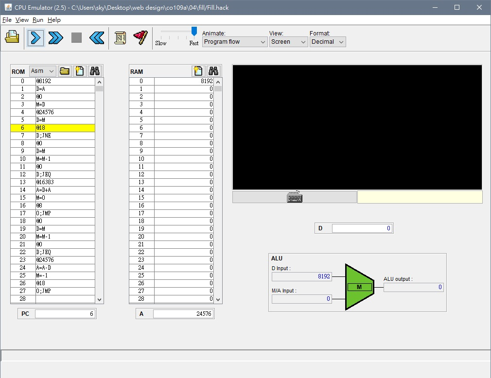

## Fill
* code
```
// This file is part of www.nand2tetris.org
// and the book "The Elements of Computing Systems"
// by Nisan and Schocken, MIT Press.
// File name: projects/04/Fill.asm

// Runs an infinite loop that listens to the keyboard input.
// When a key is pressed (any key), the program blackens the screen,
// i.e. writes "black" in every pixel;
// the screen should remain fully black as long as the key is pressed. 
// When no key is pressed, the program clears the screen, i.e. writes
// "white" in every pixel;
// the screen should remain fully clear as long as no key is pressed.

// Put your code here.
//16384---->screen
//24576---->keyboard
@8192               
D=A               
@0                
M=D                
@24576
D=M
@18                  
D;JNE            //IF OUT!=0 JUMP TO LINE 18
//WHITE LOOP
@0
D=M               
M=M-1                
@0              
D;JEQ           //IF OUT ==0 JUMP TO 0     
@16383          //16384開始是螢幕
A=D+A                
M=0              
@8                
0;JMP         //開始下次迴圈       
//BLACK LOOP
@0
D=M
M=M-1
@0
D;JEQ        //IF OUT ==0 JUMP TO 0        
@24576
A=A-D
M=-1
@18
0;JMP       //開始下次迴圈
```
