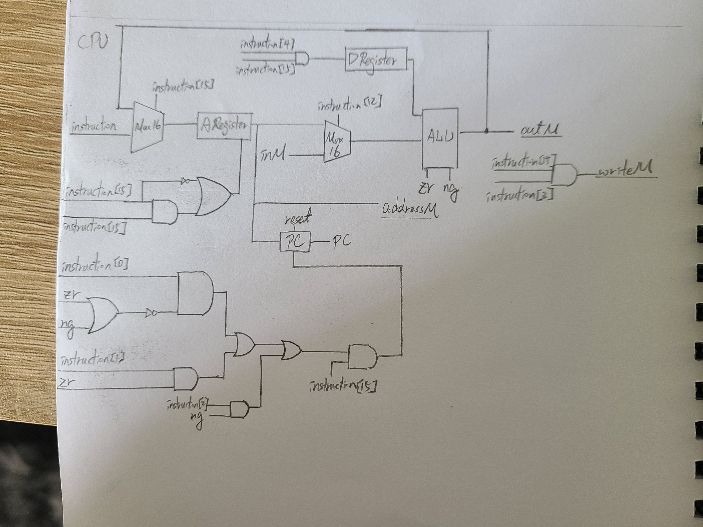

## CPU



* CODE
```
CHIP CPU {

    IN  inM[16],         // M value input  (M = contents of RAM[A])
        instruction[16], // Instruction for execution
        reset;           // Signals whether to re-start the current
                         // program (reset==1) or continue executing
                         // the current program (reset==0).

    OUT outM[16],        // M value output
        writeM,          // Write to M? 
        addressM[15],    // Address in data memory (of M)
        pc[15];          // address of next instruction

    PARTS:
    // Put your code here:
    //Decoder
    Or16(a=false,b=instruction,out[15]=isC,out[12]=a,out[11]=c1,out[10]=c2,out[9]=c3,out[8]=c4,out[7]=c5,out[6]=c6,out[5]=d1,out[4]=d2,out[3]=d3,out[2]=j1,out[1]=j2,out[0]=j3);
    
    Mux16(a=instruction,b=ALUout,sel=isC,out=M1out);//判斷是C指令還是A指令

    //Cb:A||(isC&&d1) ==> dest中有A的要寫入，所以是d1=1時要寫入
    Not(in=isC,out=isA); 
    And(a=isC,b=d1,out=Aand);
    Or(a=isA,b=Aand,out=Aload);

    //A register
    ARegister(in=M1out,load=Aload,out=Aout,out[0..14]=addressM);

    //D register
    And(a=isC,b=d2,out=Dload);
    DRegister(in=ALUout,load=Dload,out=Dout);

    //Cd
    Mux16(a=Aout,b=inM,sel=a,out=M2out);
    ALU(x=Dout,y=M2out,zx=c1,nx=c2,zy=c3,ny=c4,f=c5,no=c6,out=outM,out=ALUout,zr=zr,ng=ng);
    
    //WriteM
    And(a=isC,b=d3,out=writeM);

    //Cg
    And(a=ng,b=j1,out=JLT); //ng&&j1 
    And(a=zr,b=j2,out=JEQ); //zr&&j2
    Or(a=ng,b=zr,out=ngzr); 
    Not(in=ngzr,out=gt);    //如果不是ng||zr就是gt
    And(a=gt,b=j3,out=JGT); //gt&&j3
    Or(a=JLT,b=JEQ,out=LE);
    Or(a=LE,b=JGT,out=J);
    And(a=isC,b=J,out=PCload);
    //PC
    PC(in=Aout,load=PCload,reset=reset,inc=true,out[0..14]=pc);

}
```