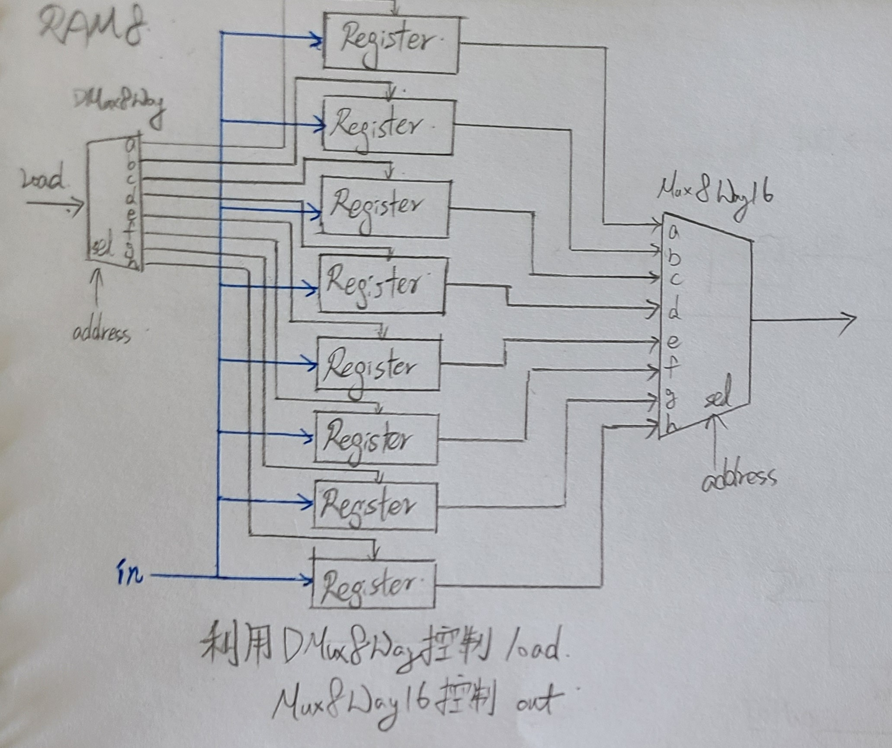
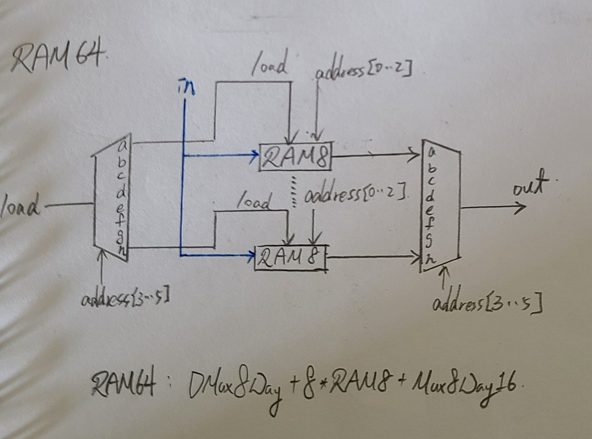
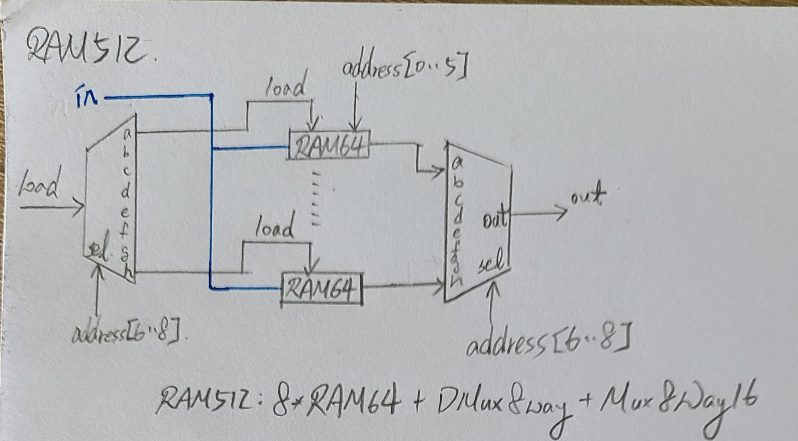
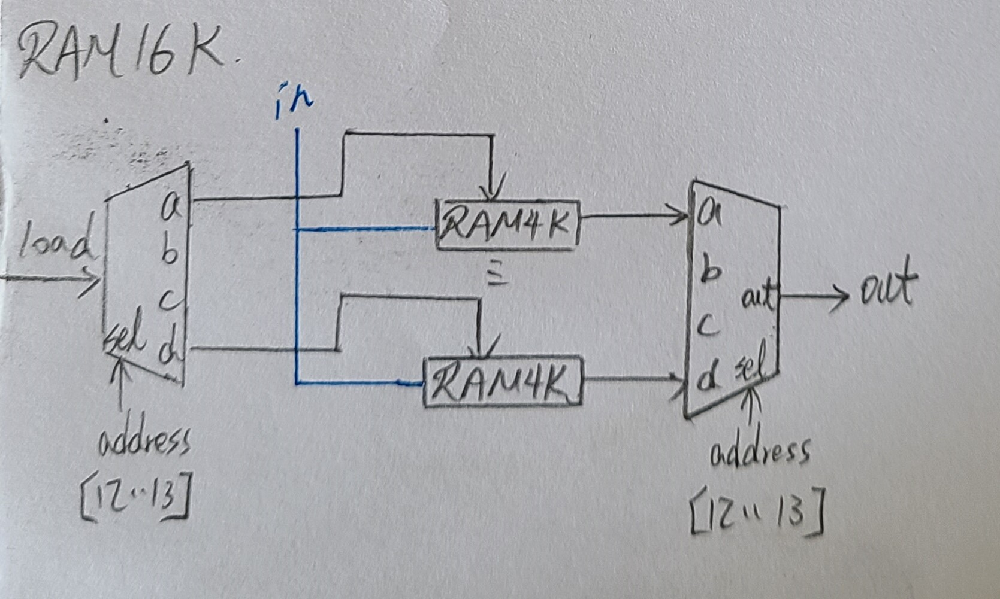

## RAM8



* CODE
```
// This file is part of www.nand2tetris.org
// and the book "The Elements of Computing Systems"
// by Nisan and Schocken, MIT Press.
// File name: projects/03/a/RAM8.hdl

/**
 * Memory of 8 registers, each 16 bit-wide. Out holds the value
 * stored at the memory location specified by address. If load==1, then 
 * the in value is loaded into the memory location specified by address 
 * (the loaded value will be emitted to out from the next time step onward).
 */

CHIP RAM8 {
    IN in[16], load, address[3];
    OUT out[16];

    PARTS:
    // Put your code here:
    DMux8Way(in=load,sel=address,a=l0,b=l1,c=l2,d=l3,e=l4,f=l5,g=l6,h=l7);
    Register(in=in,load=l0,out=r0);
    Register(in=in,load=l1,out=r1);
    Register(in=in,load=l2,out=r2);
    Register(in=in,load=l3,out=r3);
    Register(in=in,load=l4,out=r4);
    Register(in=in,load=l5,out=r5);
    Register(in=in,load=l6,out=r6);
    Register(in=in,load=l7,out=r7);
    Mux8Way16(a=r0,b=r1,c=r2,d=r3,e=r4,f=r5,g=r6,h=r7,sel=address,out=out);
}

```
## RAM64



* CODE
```
// This file is part of www.nand2tetris.org
// and the book "The Elements of Computing Systems"
// by Nisan and Schocken, MIT Press.
// File name: projects/03/a/RAM64.hdl

/**
 * Memory of 64 registers, each 16 bit-wide. Out holds the value
 * stored at the memory location specified by address. If load==1, then 
 * the in value is loaded into the memory location specified by address 
 * (the loaded value will be emitted to out from the next time step onward).
 */

CHIP RAM64 {
    IN in[16], load, address[6];
    OUT out[16];

    PARTS:
    // Put your code here:
    DMux8Way(in=load,sel=address[3..5],a=l0,b=l1,c=l2,d=l3,e=l4,f=l5,g=l6,h=l7);
    RAM8(in=in,load=l0,address=address[0..2],out=R0);
    RAM8(in=in,load=l1,address=address[0..2],out=R1);
    RAM8(in=in,load=l2,address=address[0..2],out=R2);
    RAM8(in=in,load=l3,address=address[0..2],out=R3);
    RAM8(in=in,load=l4,address=address[0..2],out=R4);
    RAM8(in=in,load=l5,address=address[0..2],out=R5);
    RAM8(in=in,load=l6,address=address[0..2],out=R6);
    RAM8(in=in,load=l7,address=address[0..2],out=R7);
    Mux8Way16(a=R0,b=R1,c=R2,d=R3,e=R4,f=R5,g=R6,h=R7,sel=address[3..5],out=out);

}
```
## RAM512



* CODE
```
// This file is part of the materials accompanying the book 
// "The Elements of Computing Systems" by Nisan and Schocken, 
// MIT Press. Book site: www.idc.ac.il/tecs
// File name: projects/03/b/RAM512.hdl

/**
 * Memory of 512 registers, each 16 bit-wide. Out holds the value
 * stored at the memory location specified by address. If load==1, then 
 * the in value is loaded into the memory location specified by address 
 * (the loaded value will be emitted to out from the next time step onward).
 */

CHIP RAM512 {
    IN in[16], load, address[9];
    OUT out[16];

    PARTS:
    // Put your code here:
    DMux8Way(in=load,sel=address[6..8],a=l0,b=l1,c=l2,d=l3,e=l4,f=l5,g=l6,h=l7);
    RAM64(in=in,load=l0,address=address[0..5],out=R0);
    RAM64(in=in,load=l1,address=address[0..5],out=R1);
    RAM64(in=in,load=l2,address=address[0..5],out=R2);
    RAM64(in=in,load=l3,address=address[0..5],out=R3);
    RAM64(in=in,load=l4,address=address[0..5],out=R4);
    RAM64(in=in,load=l5,address=address[0..5],out=R5);
    RAM64(in=in,load=l6,address=address[0..5],out=R6);
    RAM64(in=in,load=l7,address=address[0..5],out=R7);
    Mux8Way16(a=R0,b=R1,c=R2,d=R3,e=R4,f=R5,g=R6,h=R7,sel=address[6..8],out=out);
}
```
## RAM4K


* CODE
```
// This file is part of www.nand2tetris.org
// and the book "The Elements of Computing Systems"
// by Nisan and Schocken, MIT Press.
// File name: projects/03/b/RAM4K.hdl

/**
 * Memory of 4K registers, each 16 bit-wide. Out holds the value
 * stored at the memory location specified by address. If load==1, then 
 * the in value is loaded into the memory location specified by address 
 * (the loaded value will be emitted to out from the next time step onward).
 */

CHIP RAM4K {
    IN in[16], load, address[12];
    OUT out[16];

    PARTS:
    // Put your code here:
    DMux8Way(in=load,sel=address[9..11],a=l0,b=l1,c=l2,d=l3,e=l4,f=l5,g=l6,h=l7);
    RAM512(in=in,load=l0,address=address[0..8],out=R0);
    RAM512(in=in,load=l1,address=address[0..8],out=R1);
    RAM512(in=in,load=l2,address=address[0..8],out=R2);
    RAM512(in=in,load=l3,address=address[0..8],out=R3);
    RAM512(in=in,load=l4,address=address[0..8],out=R4);
    RAM512(in=in,load=l5,address=address[0..8],out=R5);
    RAM512(in=in,load=l6,address=address[0..8],out=R6);
    RAM512(in=in,load=l7,address=address[0..8],out=R7);
    Mux8Way16(a=R0,b=R1,c=R2,d=R3,e=R4,f=R5,g=R6,h=R7,sel=address[9..11],out=out);
}
```
## RAM16K



* CODE
```
// This file is part of www.nand2tetris.org
// and the book "The Elements of Computing Systems"
// by Nisan and Schocken, MIT Press.
// File name: projects/03/b/RAM16K.hdl

/**
 * Memory of 16K registers, each 16 bit-wide. Out holds the value
 * stored at the memory location specified by address. If load==1, then 
 * the in value is loaded into the memory location specified by address 
 * (the loaded value will be emitted to out from the next time step onward).
 */

CHIP RAM16K {
    IN in[16], load, address[14];
    OUT out[16];

    PARTS:
    // Put your code here:
    DMux4Way(in=load,sel=address[12..13],a=l0,b=l1,c=l2,d=l3);
    RAM4K(in=in,load=l0,address=address[0..11],out=R0);
    RAM4K(in=in,load=l1,address=address[0..11],out=R1);
    RAM4K(in=in,load=l2,address=address[0..11],out=R2);
    RAM4K(in=in,load=l3,address=address[0..11],out=R3);
    Mux4Way16(a=R0,b=R1,c=R2,d=R3,sel=address[12..13],out=out);
}
```